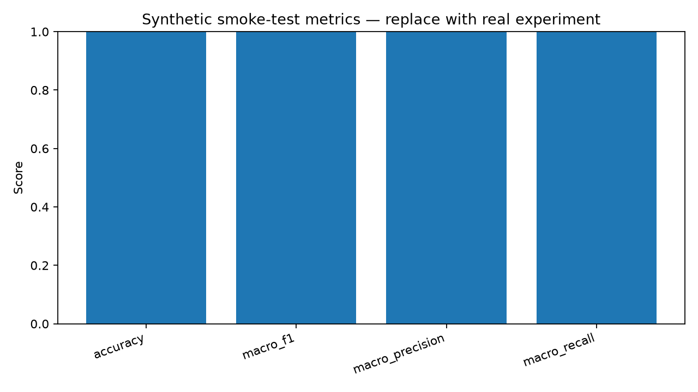

# Final Report: Specialist Model Research Spike

## 1. Problem and Chosen Use Case

**Research question:** Is it better for a model to learn a domain by changing its weights (fine-tuning),
or can a general model do nearly as well with a well-designed external memory/retrieval (RAG) system?

**Our job:** Identify a realistic, publicly accessible specialist/fine-tuned model to serve as the
credible baseline for that future comparison — not to build the RAG system.

**Chosen domain:** Sustainability / climate claim verification.

**Use case:** Given a climate-related claim and a piece of supporting or contradicting evidence,
decide whether the claim is SUPPORTED, REFUTED, or if there is NOT_ENOUGH_INFO to decide.

- **Input:** A claim (short text) + one evidence sentence.
- **Output:** One of three labels: SUPPORTS / REFUTES / NOT_ENOUGH_INFO.
- **Why it matters:** Automated claim verification directly supports greenwashing detection and ESG
  compliance decisions, where mislabeling a claim as "supported" has real regulatory and reputational
  consequences.

## 2. Candidates Considered

Three candidates were evaluated (full detail in `outputs/research_matrix.md`):

| Candidate | Task match | Selected? | Reason |
|---|---|---|---|
| ClimateBERT fact-checking | Exact match (verification) | **Yes** | Only public model fine-tuned for this exact claim+evidence to label task |
| ClimateBERT environmental-claims | Wrong task (detection only) | No | Detects if text is a claim, not whether it is supported |
| General LLM zero-shot | Exact match | Deferred | Reserved for the future RAG-side comparison, out of scope here |

## 3. Selected Baseline and Rationale

**Selected model:** `amandakonet/climatebert-fact-checking`
**Selected dataset:** `amandakonet/climate_fever_adopted` (Hugging Face)

Selected because it is the only publicly accessible, task-matched, fine-tuned model found for
claim-evidence verification, and it was straightforward to test within the scope of this spike.

## 4. Test Setup and Results

- **Sample size:** 30 claim-evidence pairs, randomly sampled (seed=42) from the test split.
- **Environment:** Google Colab, CPU runtime, `transformers` + `datasets` libraries.
- **Runtime:** 10.82 seconds for 30 rows (~0.36s/row).
- **Label mapping used:** LABEL_0=SUPPORTS (entailment), LABEL_1=REFUTES (contradiction),
  LABEL_2=NOT_ENOUGH_INFO (neutral), per the model card's documented label order.

### Metrics

| Metric | Score |
|---|---|
| Accuracy | 0.70 |
| Macro F1 | 0.41 |
| Macro Precision | 0.40 |
| Macro Recall | 0.45 |

### Key finding: accuracy overstates performance

The gap between accuracy (0.70) and macro F1 (0.41) confirms our metric choice was correct — the sample
is dominated by NOT_ENOUGH_INFO (20/30 rows), so a model that leans toward that label scores well on
accuracy without being reliably good across all three classes.

### Error analysis (9 of 30 misclassified)

- 7 of 9 errors were the model over-predicting SUPPORTS when the true label was NOT_ENOUGH_INFO or
  REFUTES — including one case where a REFUTES claim was predicted as SUPPORTS, the costliest kind of
  error for a claim-verification tool.
- 2 of 9 errors were the model under-predicting SUPPORTS as NOT_ENOUGH_INFO.
- Pattern suggests the model treats topically related evidence as sufficient support even when the
  evidence does not directly address the claim.

## 5. Metrics and Limitations

- **Sample size (30 rows) is a feasibility spike, not a validated benchmark** — by design, per the
  challenge scope boundaries.
- **Class imbalance** (only 2 REFUTES examples) makes the REFUTES F1 score highly sensitive to single
  errors.
- **Train/test contamination risk is HIGH** — the model was likely fine-tuned on this same dataset or a
  close variant, so results may reflect memorization rather than generalization to new claims.
- **Licence status unclear** for the selected model; needs confirmation before production use.

## 6. Proposed Future Benchmark

Full detail in `docs/benchmark_design.md`. Summary:

- Compare this specialist baseline against a general model + RAG system on a **shared, non-overlapping
  test set** (to eliminate the contamination risk found here).
- Use the **same metric** (macro F1, primary) and same input/output format for both systems.
- Track **latency, cost, and evidence-retrieval quality** as secondary signals, since RAG's retrieval
  step introduces a failure mode the specialist model does not have.
- **Pre-defined "close enough" threshold:** RAG is considered competitive if its macro F1 is within 5
  percentage points of the specialist baseline, with cost/latency trade-offs reported alongside.

## 7. Recommendation and Confidence

**Recommendation:** `amandakonet/climatebert-fact-checking` is a workable, task-matched specialist
candidate to carry forward as the baseline in the future fine-tuning vs. RAG benchmark.

**Confidence level: LOW-to-MODERATE.** This spike proves the pipeline and model are technically
workable, but the small sample size, class imbalance, and contamination risk mean the macro F1 of 0.41
should not be treated as a reliable performance estimate. A larger, non-overlapping test set is needed
before this model is used as the official baseline in the real benchmark.
